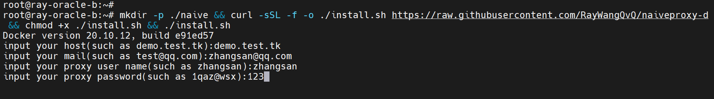
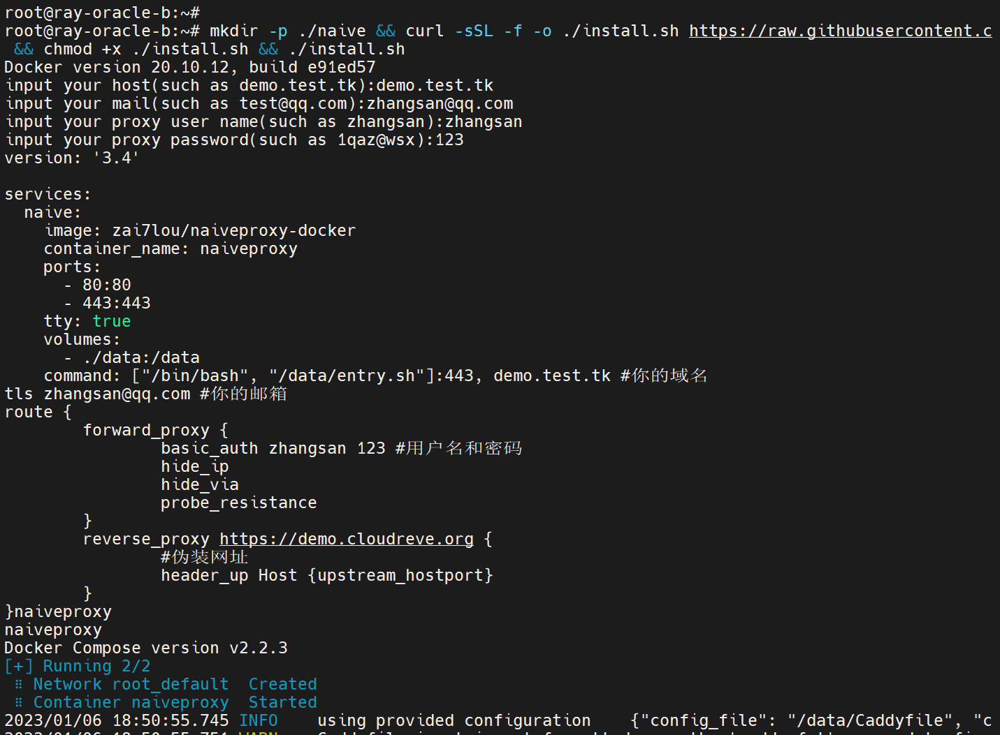
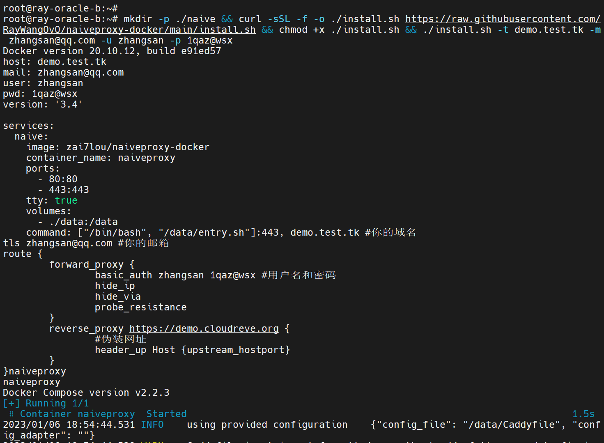
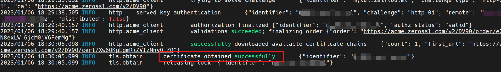
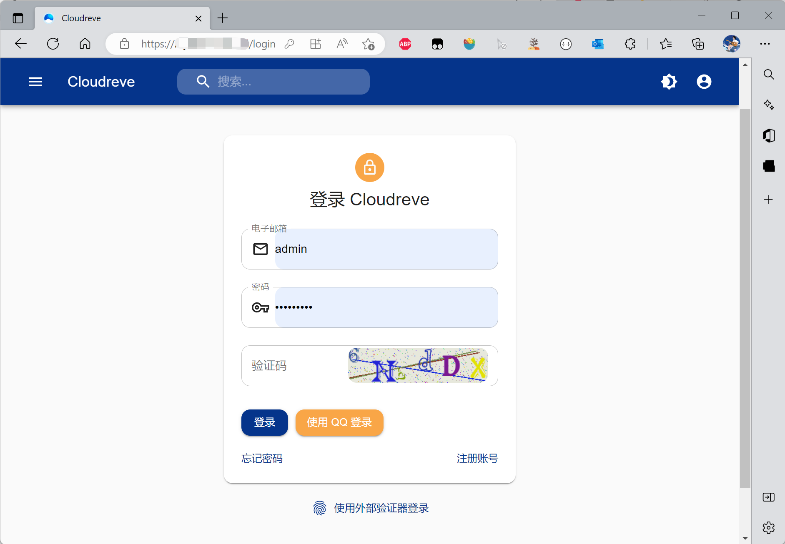

# naiveproxy-docker

基于docker的naiveproxy。

<!-- TOC depthFrom:2 -->

- [1. 说明](#1-说明)
- [2. 预备工作](#2-预备工作)
- [3. 部署服务端](#3-部署服务端)
- [4. 客户端](#4-客户端)
- [5. 自定义配置](#5-自定义配置)

<!-- /TOC -->

## 1. 说明

镜像使用官方代码生成，利用`GitHub Actions`构建并上传到`DockerHub`。

Dockerfile：[Dockerfile](Dockerfile)

DockerHub: [DockerHub](https://hub.docker.com/repository/docker/zai7lou/naiveproxy-docker/general)

## 2. 预备工作

- 一个域名
- 域名已DNS到当前服务器ip
- 服务器已安装好docker环境

P.S.不需要自己生成https证书，caddy会自动生成。

## 3. 部署服务端

一键安装脚本：

```
mkdir -p ./naive && cd ./naive

curl -sSL -f -o ./install.sh https://raw.githubusercontent.com/RayWangQvQ/naiveproxy-docker/main/install.sh && chmod +x ./install.sh && ./install.sh
```

当不指定参数时，该脚本是互动式的，运行后会提示输入相关配置信息，输入后回车即可。





当然，你也可以像下面那样，直接将参数拼接好后立即执行：

```
mkdir -p ./naive && cd ./naive 

curl -sSL -f -o ./install.sh https://raw.githubusercontent.com/RayWangQvQ/naiveproxy-docker/main/install.sh && chmod +x ./install.sh && ./install.sh -t demo.test.tk -m zhangsan@qq.com -u zhangsan -p 1qaz@wsx --verbose
```



参数说明：

- `-t`：host，你的域名，如`demo.test.tk`
- `-m`：mail，你的邮箱，用于自动颁发证书，如`zhangsan@qq.com`
- `-u`：user，proxy的用户名
- `-p`：pwd，proxy的密码
- `-f`：fakeHost，伪装域名，默认`https://demo.cloudreve.org`
- `--verbose`，输出详细日志
- `-h`：help，查看参数信息


运行到最后，颁发证书时会先ERROR飘红，别慌，等一会。如果最后出现`certificate obtained successfully`字样，就是成功了，可以Ctrl+C退出日志追踪去部署客户端了。



如果颁发证书一直不成功，请检查80端口和443端口是否开放、是否被占用。

部署成功后，浏览器访问域名，会展示伪装站点：



## 4. 客户端

很多教程，就不说了。

|  平台   | 客户端  |
| :----:  | :----: |
|  Win    | V2RayN/Nekoray |
| Linux   | Nekoray |
| MacOS   | Nekoray |
| Android | SagerNet |
| iOS     | Shadowrocket |

## 5. 自定义配置

Caddy的配置文件`Caddyfile`已被挂载到宿主机的[./data/Caddyfile](data/Caddyfile)，想要自定义配置，比如：

- 添加proxy多用户
- 修改proxy的用户名和密码
- 更改端口
- 修改伪装站点的host

等等，都可以直接在宿主机修改该文件：

```
vim ./data/Caddyfile
```

修改完成并保存成功后，让Caddy热加载配置就可以了：

```
docker exec -it naiveproxy /app/caddy reload --config /data/Caddyfile
```

举个栗子，多用户可以直接添加`forward_proxy`，像这样：

```
:443, demo.test.tk #你的域名
tls zhangsan@qq.com #你的邮箱
route {
        forward_proxy {
                basic_auth zhangsan 1qaz@wsx #用户名和密码
                hide_ip
                hide_via
                probe_resistance
        }
        forward_proxy {
                basic_auth lisi 1234 #用户名和密码
                hide_ip
                hide_via
                probe_resistance
        }
        reverse_proxy you.want.com {
                #伪装网址
                header_up Host {upstream_hostport}
        }
}
```

详细的配置语法可以参考Caddy的官方文档：[Caddy Doc](https://caddyserver.com/docs/)